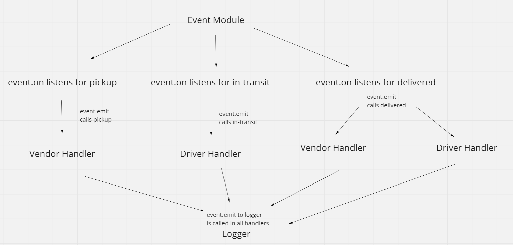

# code-academy-parcel-service

## Overview
This is an app that works with event emitters. The events of the driver, who pickups and delivers packages, are logged to the console. This is the same for the vendor, which logs that they have an order ready for pickup or an order. There is an event logger that publishes all events that happen with the order details and teh event that took place.

- You can run node index.js to see the logs or run npm test to see all the logs

## Architecture

## Change Log
- 10/03/2022 - Event emitter that will listen to for driver and vendor events and logs the action and order details
- 10/04/2022 - Added an event pool that calls event.on to for each event, index file logs all the events in order