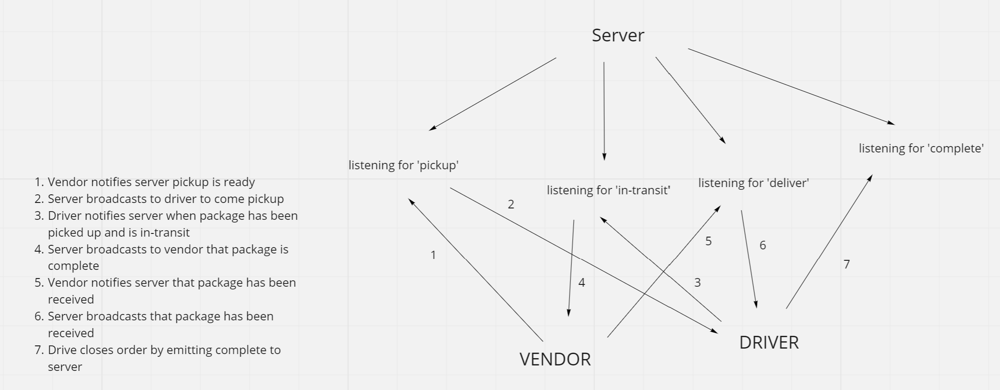

# code-academy-parcel-service

## Overview
This is an app that uses socket.io to make TCP connections between clients. Each client connects to the server. The clients emit events such as package is ready for pickup, package is in-transit, the package has been received, and the delivery is complete. The server listens for all these events and than broadcasts to other clients that have connected so that they can also know the status of the package.

## Deployed Server

## Architecture

## Change Log
- 10/03/2022 - Event emitter that will listen to for driver and vendor events and logs the action and order details
- 10/04/2022 - Added an event pool that calls event.on to for each event, index file logs all the events in order
- 10/04/2022 - Replace event emitter with socket.io and connect a vendor and driver to alert each other of package status